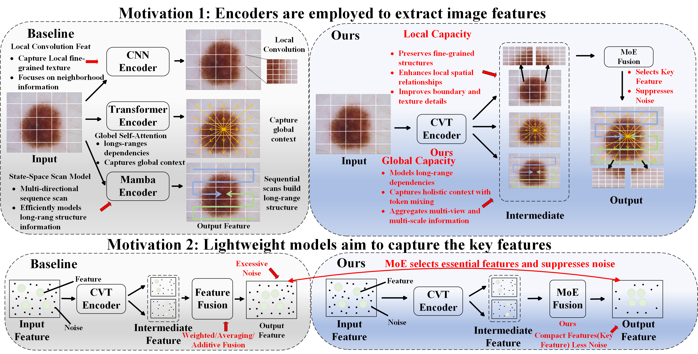
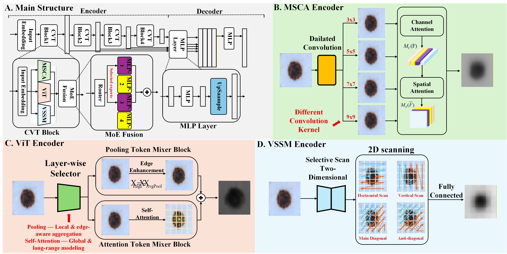
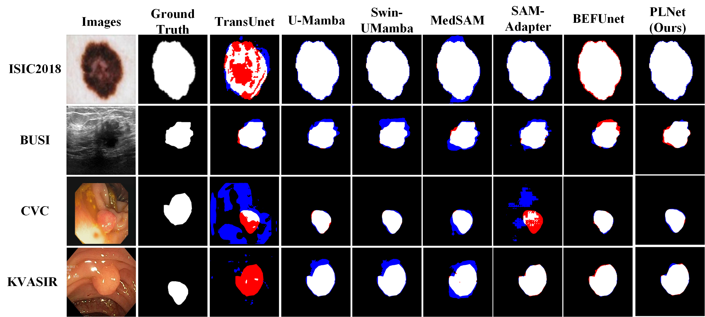

# PLNet: A Hybrid-Structured Framework for High-Definition Medical Image Segmentation


[](https://github.com/lzw514601882/PLNet)

## Key Innovation
- 🧠 A parallel multi-encoder segmentation framework: We introduce a novel parallel architecture that jointly exploits CNN, Transformer, and Mamba encoders to capture local textures, global context, and long-range dependencies for medical image segmentation, while maintaining a lightweight and efficient design.

- 🔑 MoE-based feature selection and fusion mechanism: We propose a Mixture-of-Experts module to selectively aggregate complementary features from multiple encoders, coupled with a lightweight MLP decoder to generate multi-level semantic representations with reduced redundancy and computational overhead.

- 🚀 Strong performance with high efficiency across datasets: Extensive experiments on multiple medical image segmentation benchmarks demonstrate that PLNet consistently outperforms CNN-, Transformer-, Mamba-, and hybrid-based methods, achieving state-of-the-art accuracy, robustness, and generalisation under favorable computational complexity.

## Motivation of the Framework Design
<div align="center"></div>

## Abstract
Although general medical image segmentation models have shown good overall performance, accurately capturing boundary details remains challenging due to the small proportion of target regions and the presence of noise that reduces edge contrast. In this study, we propose a hybrid framework, PLNet, for precise segmentation of medical images. PLNet incorporates a specially designed lightweight CVT encoder, which consists of three sub-encoders: a CNN encoder for capturing local details, a ViT encoder with self-attention, and a VSSM encoder with recurrent mechanisms for modelling long-range dependencies and global contextual information. Additionally, a MoE module is integrated to selectively extract key features, suppress redundant information, and reduce computational complexity without compromising segmentation accuracy. Experimental results demonstrate that PLNet achieves superior performance across multiple medical image datasets. On skin cancer images, it attains an IoU of 79.57\% and a Dice score of 88.62\%, with a computational cost of only 26.15 GFLOPs and 21.47M parameters. Compared with existing state-of-the-art models, PLNet improves segmentation accuracy while substantially reducing computational demands.

## Main structure
<div align="center"></div>

## 📊 Dataset Overview


### The details of two publicly available datasets in our task
| Dataset | Modality | Image Resolution | Total Images | Train / Test Split | Task | Description | Download Link |
|---|---|---|---:|---:|---|---|---|
| ISIC2017 | Dermoscopy | 3024 × 2016 | 2750 | 2475 / 275 (9:1) | Skin lesion segmentation | Large-scale dermoscopic dataset released by ISIC, primarily focused on melanoma segmentation. | https://challenge.isic-archive.com/data/ |
| ISIC2018 | Dermoscopy | 4288 × 2848 | 3700 | 3330 / 370 (9:1) | Skin lesion segmentation | High-resolution dermoscopic dataset covering multiple skin lesion categories. | https://challenge.isic-archive.com/data/ |
| CVC-ClinicDB | Colonoscopy | Various | 612 | 428 / 184 (7:3) | Polyp segmentation | Colonoscopy images with pixel-level annotations for colorectal polyp detection. | https://polyp.grand-challenge.org/CVCClinicDB/ |
| BUSI | Ultrasound | 500 × 500 | 780 | 546 / 234 (7:3) | Breast tumor segmentation | Breast ultrasound dataset with detailed annotations for normal, benign, and malignant tumors. | https://scholar.cu.edu.eg/?q=afahmy/pages/dataset |
| Kvasir-SEG | Endoscopy | Various | 1000 | 700 / 300 (7:3) | Polyp segmentation | Endoscopic dataset with expert-verified pixel-level annotations for colorectal polyps. | https://datasets.simula.no/downloads/kvasir-seg.zip |

## Dataset

``` 📂 ISIC2018/
├── img_dir/               # Images dataset
  ├── train/             # Train of images (input)
    ├── ISIC_0000000.jpg/               # Case ID = 00000 (input)
    ├── ISIC_0000001.jpg/               # Case ID = 00001 (input)
    ├── ISIC_0000003.jpg/               # Case ID = 00003 (input)
    ├── ...
    ├── ISIC_0036346.jpg/               # Case ID = 36346 (input)
  ├── val/             # Test of images (input)
    ├── ISIC_0000002.jpg/               # Case ID = 00002 (input)
    ├── ISIC_0000006.jpg/               # Case ID = 00006 (input)
    ├── ...
    ├── ISIC_0036347.jpg/               # Case ID = 36347 (input)
└── lable_complete/                     # Mask dataset
├── ann_dir/               # Images dataset
  ├── train/             # Train of Label (input)
    ├── ISIC_0000000.png/               # Case ID = 00000 (ground truth)
    ├── ISIC_0000001.png/               # Case ID = 00001 (ground truth)
    ├── ISIC_0000003.png/               # Case ID = 00003 (ground truth)
    ├── ...
    ├── ISIC_0036346.png/               # Case ID = 36346 (ground truth)
  ├── val/             # Test of Label (input)
    ├── ISIC_0000002.png/               # Case ID = 00002 (ground truth)
    ├── ISIC_0000006.png/               # Case ID = 00006 (ground truth)
    ├── ...
    ├── ISIC_0036347.png/               # Case ID = 36347 (ground truth)
```

### The other data formats have the same structure

## Qualitative Visualization Results
<div align="center"></div>

## Acknowledgements
- We thank Medical Image Computing for making the source code of [nnUNet](https://github.com/MIC-DKFZ/nnUNet) publicly avaiable.
- We also thank Bastian Chen for sharing the great article [LEFORMER](https://ieeexplore.ieee.org/document/10446785)

